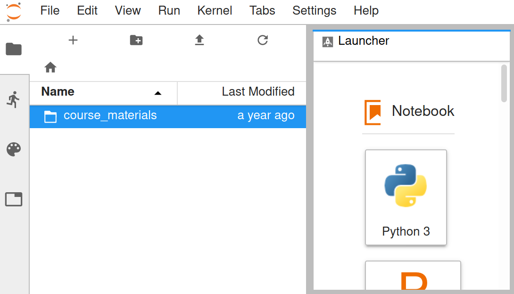

Kiel University is running a [Jupyterhub](https://jupyter.org/hub) to provide access to its computing resources and teaching material for educational purposes. All the information given below will apply to the instance reachable at https://weblab.uni-kiel.de.

## General Information

### Student Accounts
The students will get an unique account for each module and each semester. The naming scheme for this class of accounts is `(ws|ss)[0-9]{2}modulename[0-9]{2}`. E.g., a student account for the module _climnum_ in the _winter semester 2020/21_ may have the name `ws20climnum07`.

The account names are assigned by the tutor of the module in the beginning of the semester. The account password is set upon first login y the student. Simply type a password into the `password` text field as shown below and hit the `Sign In` button, as show below.

The passwords will not be stored in a readable or retrievable form on the system. In case you lost your password, please contact your tutor.

### Course Materials
Every user will have a separate home directory to which only the user itself and the system administrator have access. Within this home directory, you will find a link to the course materials.

The course materials are readable by all users of the system and writable by the tutor of the respective course. Permissions are set by the system administrator at the beginning of the course.

The name of a course materials' directory is the module name prefixed by the semester (`(ws|ss)[0-9]{2}modulename`), e.g. `ss21climnum`.

## Terms of Use
By signing in on https://weblab.uni-kiel.de you are accepting the terms of use as stated below.

The use of the system is allowed for educational purposes only.
In particular, the use by a student account (as described above) is restricted to working on the material of the course the account is created for.
Every user is legally responsible for the content he or she is creating and/or distributing with this system.

There is no guaranty on the availability of the system at any time.

### User and Data Deletion
If not stated otherwise, student user accounts will be deleted without prior notification at the end of the second examination period of the semester they are created for. E.g. `ws20climnum23` will be deleted at the end of the second examination period of Winter semester 2020/21. All data within the home directory of the user are deleted together with the account credentials.
-
### Usage Statistics
To improve the service and to monitor its general usage, aggregated usage statistics, such as the number of active users or total memory consumption, are continuously recorded and analyzed. This data may also be shared with external partners. Logs of personalized data will never be shared with anyone and are only accessible to the system administrator.
